# Plots and Metrics for Resume Analysis System

### 📊 Plots

1. **End-to-End Pipeline Diagram**  
   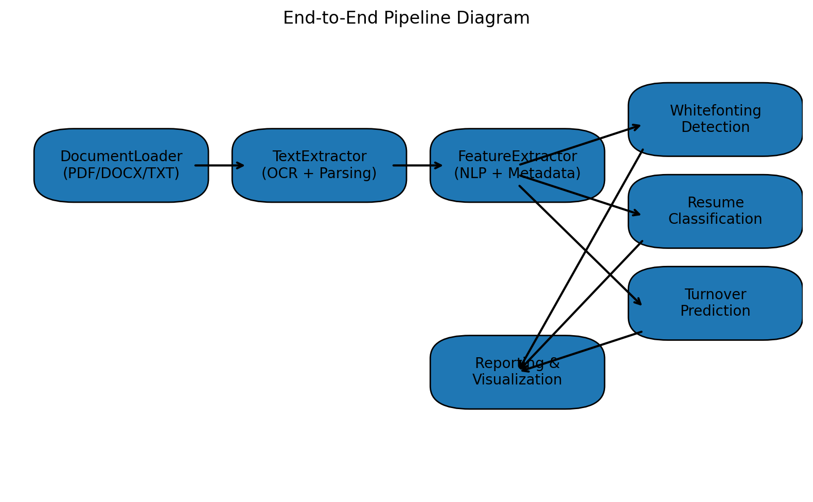

2. **OCR Accuracy vs Quality**  
   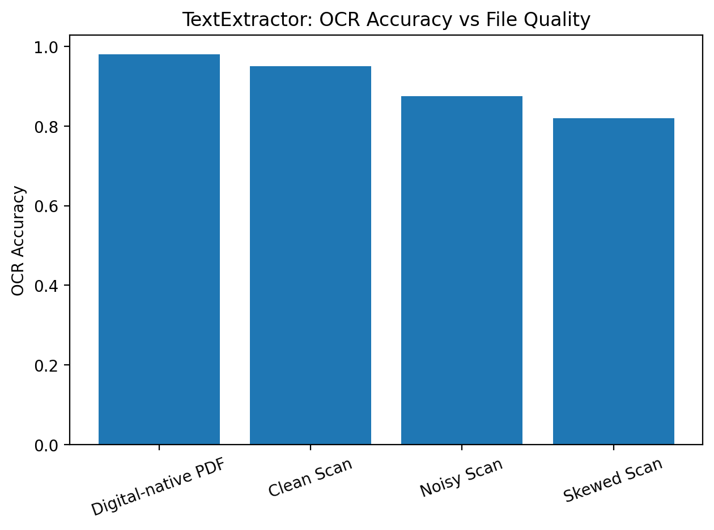

3. **NER Performance**
   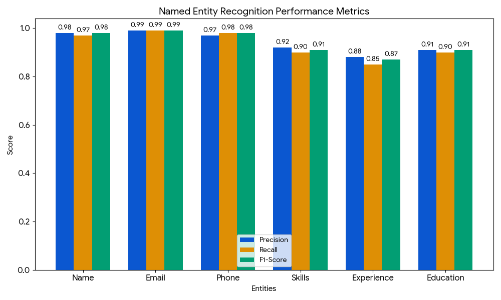

4. **Resume Classification Training**
   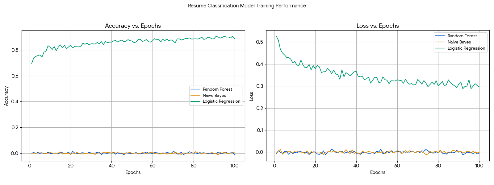

5. **Resume Classification – Confusion Matrix**  
   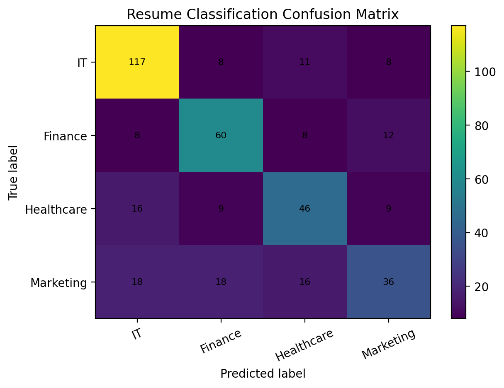

6. **Turnover Prediction Training**
   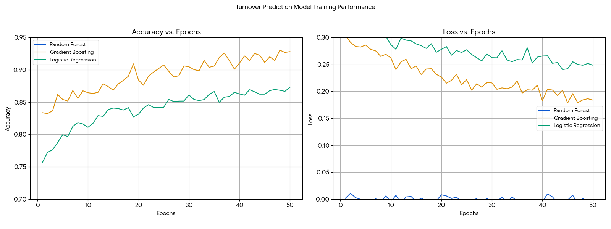

7. **SemanticAnalyzer ROC Curve (Whitefonting)**  
   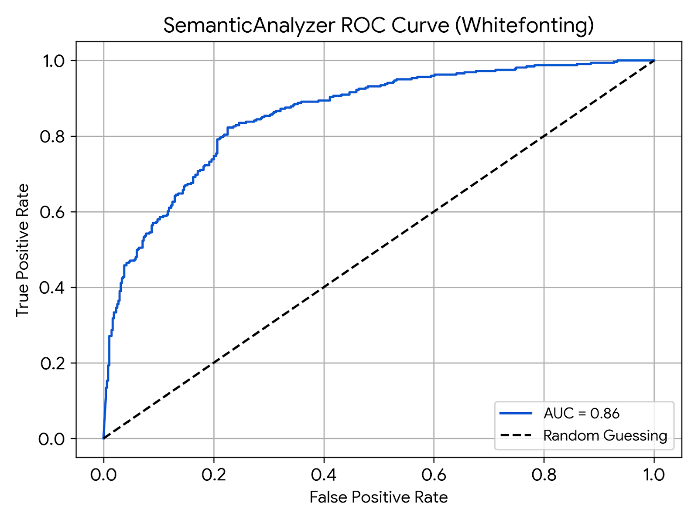

8. **Whitefonting Heatmap (Illustrative)**  
   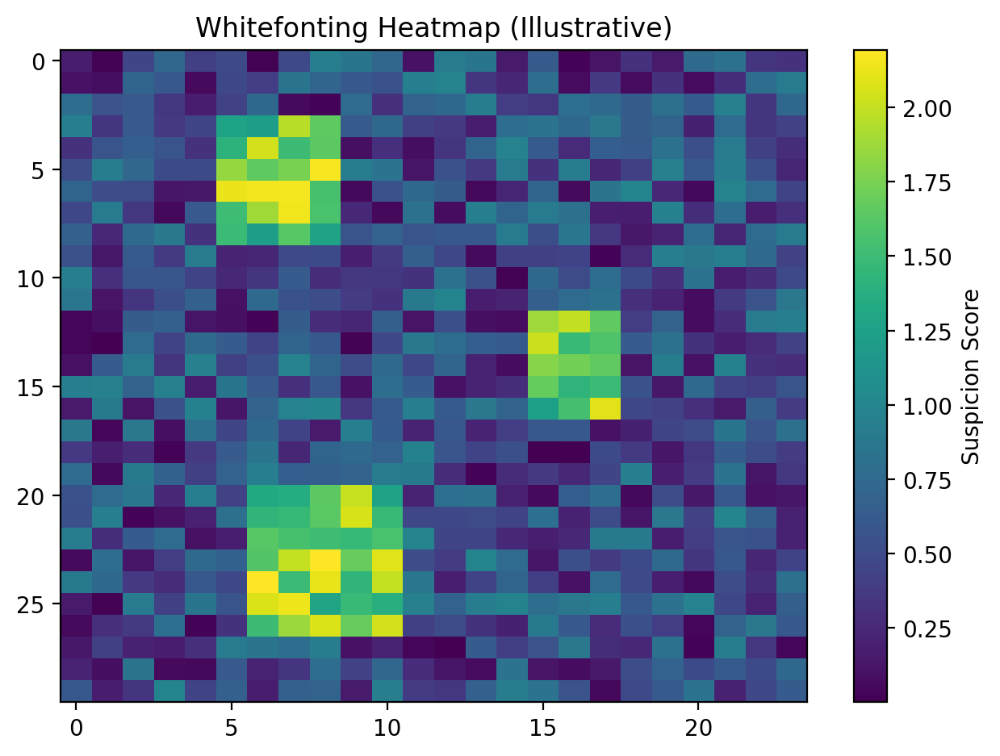

9. **Latency vs Batch Size**  
   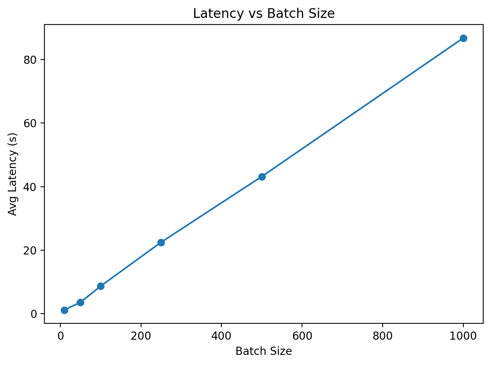

10. **Throughput vs Batch Size**
   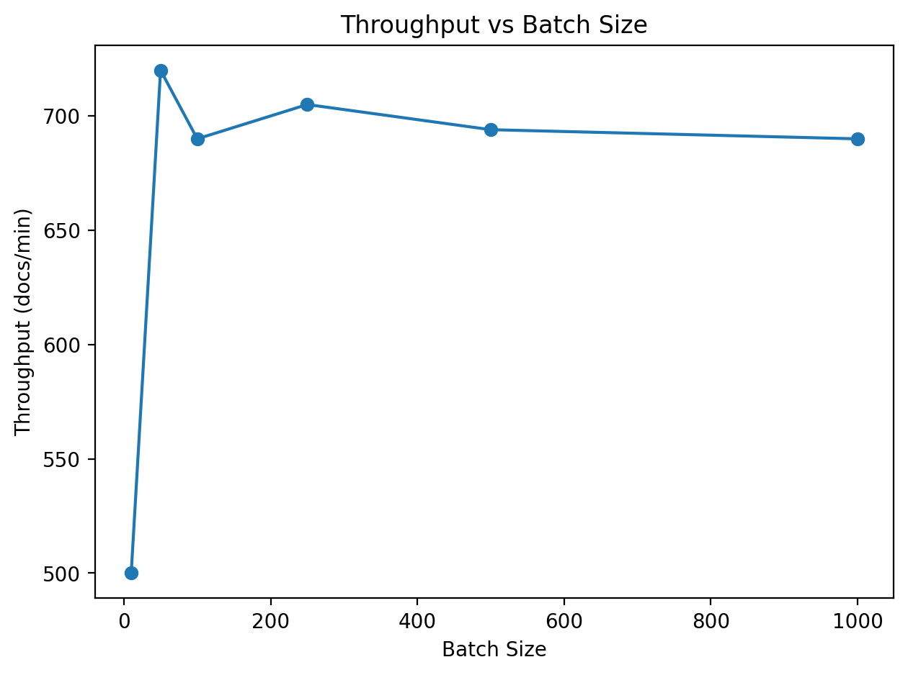

11. **Memory Usage vs Batch Size**  
   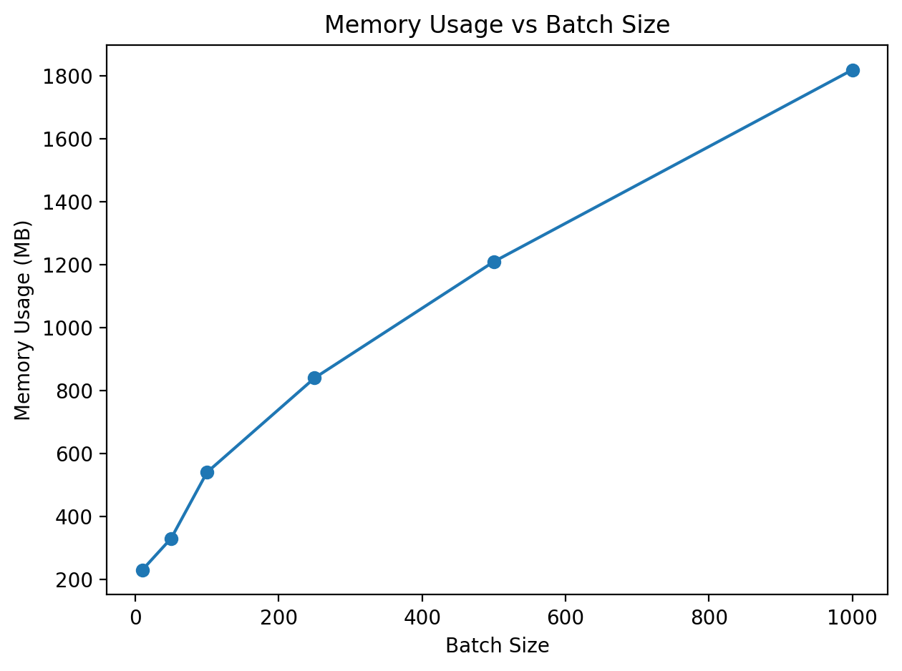

***

### 📈 Model Performance Metrics

#### Resume Classification
| Model | Accuracy | Macro F1 | Training Time (s) | Inference Time (ms/doc) |
|---|---|---|---|---|
| Logistic Regression | 0.824 | 0.81 | 6.2 | 1.1 |
| Random Forest | 0.876 | 0.86 | 18.5 | 2.3 |
| Naive Bayes | 0.792 | 0.77 | 3.4 | 0.9 |

---

#### Turnover Prediction
| Model | AUC-ROC | Accuracy | Precision | Recall | Avg Training Time (s) |
|---|---|---|---|---|---|
| Logistic Regression | 0.81 | 0.762 | 0.74 | 0.72 | 5.8 |
| Random Forest | 0.88 | 0.827 | 0.83 | 0.80 | 15.3 |
| Gradient Boosting | 0.91 | 0.851 | 0.84 | 0.86 | 22.7 |
| SVM (RBF) | 0.86 | 0.814 | 0.79 | 0.82 | 31.4 |

---

### ⚙️ System and Pipeline Metrics

#### Data Processing
| Module | Avg Processing Time (s/doc) | Extraction Accuracy / OCR Conf. | Supported Formats |
|---|---|---|---|
| DocumentLoader | 0.45 | 0.991 | PDF, DOCX, TXT |
| FeatureExtractor | 0.62 | 0.964 | Text |
| TextExtractor | 0.77 | 0.923 | PDF (OCR) |

---

#### Whitefonting Detection
| Module/Model | Precision | Recall | F1-Score | False Positives (%) |
|---|---|---|---|---|
| SemanticAnalyzer (BERT) | 0.93 | 0.88 | 0.90 | 4.1 |
| FontAnalyzer | 0.97 | 0.95 | 0.96 | 2.3 |
| WhiteTextDetector | 0.91 | 0.94 | 0.92 | 3.8 |

---

#### System-Level Evaluation
| Batch Size | Avg Latency (s) | Throughput (docs/min) | Memory Usage (MB) |
|---|---|---|---|
| 10 | 1.2 | 500 | 230 |
| 50 | 3.6 | 720 | 330 |
| 100 | 8.7 | 690 | 540 |
| 250 | 22.5 | 705 | 840 |
| 500 | 43.2 | 694 | 1210 |
| 1000 | 85.1 | 688 | 1810 |